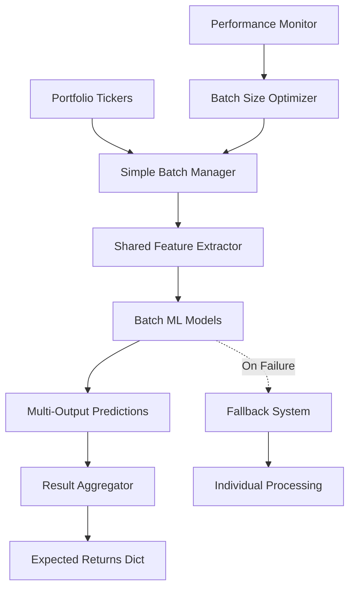

# Design Document

## Overview

The batch forecasting optimization feature will transform the current individual ticker processing approach into a high-performance batch processing system. The design leverages multi-output machine learning models, vectorized operations, and shared feature extraction to achieve significant performance improvements while maintaining or improving forecast accuracy.

The core innovation is replacing the current `_forecast_single_ticker` pattern with batch-aware models that can process multiple tickers simultaneously, sharing computational resources and learning cross-ticker relationships.

## Architecture

### High-Level Architecture



### Core Components

1. **BatchForecastingSystem**: Main orchestrator that replaces individual ticker processing
2. **SimpleBatchManager**: Simple, fast batch creation without complex analysis
3. **SharedFeatureExtractor**: Extracts common market features once per batch
4. **BatchAwareModels**: ML models adapted for multi-output prediction (XGBoost primary, Linear fallback)
5. **FallbackCoordinator**: Manages graceful degradation to individual processing

### Model Selection Strategy

The system uses a simple, hardcoded model selection approach for maximum speed:

1. **Primary Model**: BatchXGBoostForecaster - Fast, accurate multi-output regression
2. **Fallback Model**: BatchLinearForecaster - Simple linear regression for when XGBoost fails
3. **No Ensemble**: Ensemble methods are disabled to reduce complexity and improve speed
4. **No Tiered Selection**: Fixed model order eliminates selection overhead

## Components and Interfaces

### BatchForecastingSystem

```python
class BatchForecastingSystem:
    """
    Main system for batch-based forecasting with intelligent grouping and fallback.
    """
    
    def __init__(self, config: BatchForecastingConfig):
        self.batch_manager = SimpleBatchManager(config.batch_size)
        self.feature_extractor = SharedFeatureExtractor(config.features)
        self.batch_models = self._initialize_batch_models(config.models)
        self.fallback_coordinator = FallbackCoordinator(config.fallback)
        self.performance_monitor = BatchPerformanceMonitor()
    
    def forecast_batch_returns(self, 
                              tickers: List[str], 
                              data: pd.DataFrame, 
                              periods: int = 1) -> Dict[str, float]:
        """
        Main entry point for batch forecasting.
        
        Args:
            tickers: List of ticker symbols
            data: Historical price data with tickers as columns
            periods: Forecast horizon
            
        Returns:
            Dictionary mapping tickers to expected returns
        """
        
    def _process_single_batch(self, 
                             ticker_group: List[str], 
                             batch_data: pd.DataFrame,
                             shared_features: pd.DataFrame) -> Dict[str, float]:
        """Process a single batch of tickers."""
        
    def _extract_batch_features(self, 
                               ticker_group: List[str], 
                               data: pd.DataFrame) -> Tuple[pd.DataFrame, pd.DataFrame]:
        """Extract individual and shared features for a batch."""
```

### SimpleBatchManager

```python
class SimpleBatchManager:
    """
    Simple batch management focused on performance without complex analysis.
    """
    
    def create_batches(self, 
                      tickers: List[str], 
                      max_batch_size: Optional[int] = None) -> List[List[str]]:
        """
        Create batches using simple, fast strategies.
        
        Strategies:
        1. Single batch (default): Process all tickers together
        2. Size-based chunking: Split into equal-sized chunks if memory constraints exist
        """
        
    def _single_batch_strategy(self, tickers: List[str]) -> List[List[str]]:
        """Return all tickers as a single batch."""
        
    def _chunk_based_strategy(self, tickers: List[str], max_batch_size: int) -> List[List[str]]:
        """Split tickers into equal-sized chunks."""
```

### BatchAwareModels

```python
class BatchLSTMForecaster(BaseForecaster):
    """
    LSTM model adapted for batch processing with multi-output capability.
    """
    
    def fit_batch(self, 
                  batch_data: pd.DataFrame, 
                  shared_features: pd.DataFrame,
                  tickers: List[str]) -> None:
        """
        Fit model on batch data with shared features.
        
        Args:
            batch_data: Price data for all tickers in batch
            shared_features: Market-wide features (VIX, indices, etc.)
            tickers: List of ticker symbols in batch
        """
        
    def predict_batch(self, 
                     periods: int,
                     shared_features: pd.DataFrame) -> Dict[str, float]:
        """
        Generate predictions for all tickers in the batch.
        
        Returns:
            Dictionary mapping tickers to expected returns
        """

class BatchXGBoostForecaster(BaseForecaster):
    """
    XGBoost model with multi-output regression for batch processing.
    Primary model for speed and accuracy balance.
    """
    
    def fit_batch(self, batch_data: pd.DataFrame, shared_features: pd.DataFrame, tickers: List[str]) -> None:
        """Fit multi-output XGBoost model with hardcoded optimal parameters."""
        
    def predict_batch(self, periods: int, shared_features: pd.DataFrame) -> Dict[str, float]:
        """Generate batch predictions using multi-output regression."""

class BatchLinearForecaster(BaseForecaster):
    """
    Simple linear regression model for batch processing.
    Fast fallback model when XGBoost fails.
    """
    
    def fit_batch(self, batch_data: pd.DataFrame, shared_features: pd.DataFrame, tickers: List[str]) -> None:
        """Fit multi-output linear regression model."""
        
    def predict_batch(self, periods: int, shared_features: pd.DataFrame) -> Dict[str, float]:
        """Generate batch predictions using linear regression."""
```

### SharedFeatureExtractor

```python
class SharedFeatureExtractor:
    """
    Extracts market-wide features that benefit all tickers in a batch.
    """
    
    def extract_features(self, 
                        data: pd.DataFrame, 
                        tickers: List[str]) -> Tuple[pd.DataFrame, pd.DataFrame]:
        """
        Extract individual ticker features and shared market features.
        
        Returns:
            Tuple of (individual_features, shared_features)
        """
        
    def _extract_market_features(self, data: pd.DataFrame) -> pd.DataFrame:
        """
        Extract market-wide features:
        - Market volatility (VIX-like calculation)
        - Sector indices performance
        - Economic indicators
        - Cross-ticker correlations
        """
        
    def _extract_individual_features(self, data: pd.DataFrame, tickers: List[str]) -> pd.DataFrame:
        """
        Extract ticker-specific features:
        - Technical indicators per ticker
        - Price momentum
        - Volatility measures
        - Volume patterns
        """
```

## Data Models

### BatchForecastingConfig

```python
@dataclass
class BatchForecastingConfig:
    """Configuration for batch forecasting system."""
    
    # Batch configuration
    batch: BatchConfig
    
    # Feature extraction configuration
    features: FeatureConfig
    
    # Model configuration
    models: ModelConfig
    
    # Fallback configuration
    fallback: FallbackConfig
    
    # Performance configuration
    performance: PerformanceConfig

@dataclass
class BatchConfig:
    """Configuration for batch processing."""
    
    strategy: str = "single_batch"  # "single_batch", "chunked"
    max_batch_size: Optional[int] = None  # None means no limit, process all together
    chunk_size: int = 50  # Size of chunks if using chunked strategy
    
@dataclass
class FeatureConfig:
    """Configuration for feature extraction."""
    
    include_market_features: bool = True
    include_sector_features: bool = True
    include_technical_indicators: bool = True
    lookback_window: int = 252  # Days of historical data to use
    
@dataclass
class ModelConfig:
    """Configuration for batch models."""
    
    primary_model: str = "batch_xgboost"  # Single hardcoded model for speed
    fallback_model: str = "batch_linear"  # Simple fallback model
    use_ensemble: bool = False  # Disabled for speed
    parallel_training: bool = True
    max_training_time: int = 60  # Reduced timeout for speed
    
@dataclass
class BatchPerformanceMetrics:
    """Performance metrics for batch processing."""
    
    batch_size: int
    processing_time: float
    memory_usage: float
    accuracy_metrics: Dict[str, float]
    speedup_factor: float  # Compared to individual processing
    fallback_rate: float  # Percentage of tickers that fell back to individual processing
```

## Error Handling

### Graceful Degradation Strategy

1. **Batch Processing Failure**: If entire batch fails, split into smaller batches
2. **Model Training Failure**: Fall back to simpler batch models or individual processing
3. **Memory Constraints**: Automatically reduce batch size and retry
4. **Individual Ticker Issues**: Remove problematic tickers from batch, process individually

### Error Recovery Hierarchy

```python
class BatchErrorHandler:
    """
    Comprehensive error handling for batch processing.
    """
    
    def handle_batch_error(self, 
                          error: Exception, 
                          batch_context: BatchContext) -> BatchRecoveryResult:
        """
        Handle batch processing errors with multiple recovery strategies.
        
        Recovery strategies:
        1. Retry with smaller batch size
        2. Remove problematic tickers
        3. Fall back to simpler models
        4. Use individual processing for failed tickers
        """
        
    def _split_batch_recovery(self, tickers: List[str], error: Exception) -> List[List[str]]:
        """Split failed batch into smaller batches."""
        
    def _remove_problematic_tickers(self, tickers: List[str], data: pd.DataFrame) -> List[str]:
        """Identify and remove tickers causing batch failures."""
```

## Testing Strategy

### Unit Testing

1. **TickerGroupingEngine Tests**
   - Test different grouping strategies
   - Validate group size constraints
   - Test edge cases (single ticker, empty data)

2. **BatchAwareModels Tests**
   - Test multi-output prediction accuracy
   - Validate batch vs individual prediction consistency
   - Test memory usage with different batch sizes

3. **SharedFeatureExtractor Tests**
   - Validate feature extraction correctness
   - Test performance with different data sizes
   - Test handling of missing data

### Integration Testing

1. **End-to-End Batch Processing**
   - Test complete pipeline with real market data
   - Validate performance improvements
   - Test fallback mechanisms

2. **Performance Benchmarking**
   - Compare batch vs individual processing times
   - Memory usage profiling
   - Accuracy comparison studies

### Performance Testing

1. **Scalability Tests**
   - Test with portfolios of 10, 25, 50, 100+ tickers
   - Memory usage under different batch sizes
   - Processing time scaling analysis

2. **Stress Testing**
   - Test with poor quality data
   - Test with highly correlated tickers
   - Test with missing data scenarios

## Implementation Phases

### Phase 1: Core Batch Infrastructure
- Implement BatchForecastingSystem skeleton
- Create SimpleBatchManager with single-batch and chunking strategies
- Implement SharedFeatureExtractor

### Phase 2: Batch-Aware Models
- Implement BatchXGBoostForecaster with multi-output regression
- Implement BatchLinearForecaster as simple fallback
- Remove ensemble and LSTM complexity for speed

### Phase 3: Integration and Optimization
- Integrate with existing portfolio_optimization.py
- Implement comprehensive error handling
- Performance optimization and tuning

### Phase 4: Advanced Features
- Dynamic batch size optimization based on memory usage
- Advanced shared feature engineering
- Performance monitoring and auto-tuning